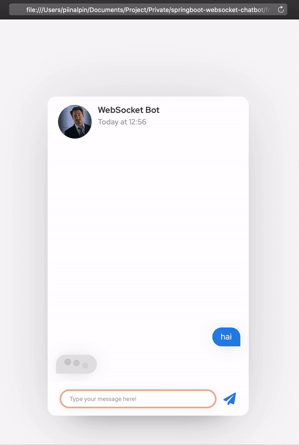

# Spring Boot Web Socket Chat Bot

An example how I integrating between contextual chat bot with web socket on spring boot and javascript client.


## Requirements

- Python 3.x
- JDK 11
- Maven 3.x

## How to run

- Clone this project 
    ```bash
    git clone https://github.com/piinalpin/springboot-websocket-chatbot.git
    ```
- Run `chatbot` with python
    ```bash
    cd python-chatbot
    pip install -r requirements.txt
    python main.py
    ```
- Run `websocket-server`
    ```bash
    cd websocket-server
    mvn spring-boot: run
    ```
- Run `client` service, open `frontend/index.html` through your browser and lets start messaging with chat bot.

## Example Runnning

